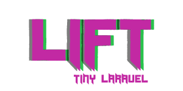

<p align="center"></p>
<h1></h1>
<center>Lift is a small framework that creates a rest api,
the goal of the lift is to always be small, poison is stored in small bottles.</center>
<h1></h1>
<h3>Usage</h3>

api/router.php
```php
const routers = [
    'users/list/'   => ['get:users@list', 'model', 'cursor' => ['*']],
];
```

Create new class file in api/controllers/ example Users.php

Create new table Users.

Roll it.

<h3>Example class</h3>

```php
class users {
    public static function list(Lift $lift){
        /**Logic*/
        return $lift->model->where('username = "lift"')->first();
    }
}
```

<h3>Where</h3>

```php
$lift->model->where('username = "lift"')->where('passwrod  = "lift123"')->first();
```

<h3>Selectable</h3>

```php
$lift->model->select(['username', 'password'])->where('username = "lift"') ->get();
```

<h3>orWhere</h3>

```php
$lift->model->where('username = "lift"')->orWhere('username  like "lif%"')->first();
```

<h3>innerJoin , leftJoin, rightJoin</h3>

```php
->innerJoin
->leftJoin
->rightJoin
$lift->model->where('username = "lift"')
->EXAMPLES(['posts', 'posts.username', 'example.username'])->get();
```

<h3>Order by</h3>

```php
$user = $lift->model->where('username like "%a%"')->orderBy('username asc')->first();
```

<h3>Update</h3>

```php
$user = $lift->model->where('username = "lift"')->first();

$user->username =  'newUsername';

$lift->model->save($user);
```

<h3>Insert</h3>

```php
$user = new stdClass;

$user->username = 'test1';
$user->password = '12345';
$user->email = 'test@bla.com';

$lift->model->insert($user);
```